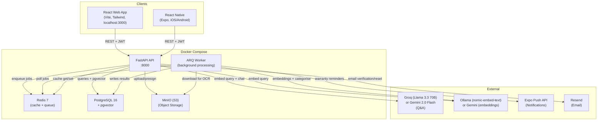
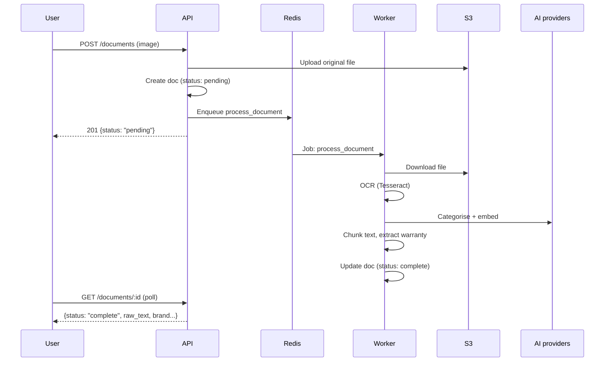

# AI Cloud Document Vault

> Snap it. Store it. Ask it anything.

A cloud-based document management app that lets you digitise physical documents (manuals, warranties, guides) and query them with AI. Never lose a manual again — and never flip through 60 pages to find one answer.

## Quick Start

### Prerequisites
- Docker & Docker Compose
- Node.js 20+
- (Optional) A Groq or Google Gemini API key for AI Q&A (embeddings run locally via Ollama by default)

### Run the app

```bash
# 1. Start the backend (API + database + storage)
docker compose up --build

# 2. Start the frontend
cd frontend && npm install && npm run dev
```

Open http://localhost:3000 — register an account and start uploading documents.

### Run the mobile app

```bash
cd mobile && npm install && npx expo start
```

Scan the QR code with Expo Go on your phone.

## Features

| Feature | Description |
|---------|-------------|
| 📷 Document Capture | Upload photos of physical documents (JPEG, PNG, WebP, PDF) |
| 🔍 OCR | Text extraction via Tesseract (default), Mistral OCR, or AWS Textract — set by `OCR_BACKEND` |
| 🏷️ Auto-Categorisation | AI detects brand, model, and document type (Mistral) |
| 🔎 Hybrid Search | Vector + full-text search fused with Reciprocal Rank Fusion — find by meaning or exact terms |
| 💬 AI Q&A | Ask questions and get answers grounded in your documents (RAG with a relevance floor) |
| 🔒 Authentication | JWT access + refresh tokens, TOTP 2FA, Google OAuth, per-user data isolation |
| 📱 Cross-Platform | Web app + React Native mobile app |
| ☁️ Cloud-Ready | Terraform modules for AWS deployment |

## Architecture



### Data flow: Document upload



## API Endpoints

| Method | Endpoint | Description |
|--------|----------|-------------|
| POST | `/api/v1/auth/register` | Create account (email verification) |
| POST | `/api/v1/auth/login` | Login → access + refresh tokens (2FA-aware) |
| POST | `/api/v1/auth/refresh` | Rotate refresh token for a new access token |
| POST | `/api/v1/auth/forgot-password` | Request a password reset link |
| POST | `/api/v1/auth/reset-password` | Reset password with an emailed token |
| GET | `/api/v1/auth/oauth/google` | Begin Google OAuth sign-in |
| POST | `/api/v1/documents` | Upload document (OCR + AI) |
| GET | `/api/v1/documents` | List documents (filterable) |
| GET | `/api/v1/documents/{id}` | Get document detail |
| PATCH | `/api/v1/documents/{id}` | Update metadata |
| DELETE | `/api/v1/documents/{id}` | Delete document |
| POST | `/api/v1/documents/{id}/reprocess` | Re-run OCR + AI |
| GET | `/api/v1/search?q=` | Hybrid search (vector + keyword) |
| POST | `/api/v1/ai/ask` | Ask a question (RAG) |
| GET | `/api/v1/ai/status` | AI provider availability |
| GET | `/api/v1/conversations` | List saved AI chat threads |
| GET | `/api/v1/categories` | List categories |
| POST | `/api/v1/categories` | Create category |
| GET | `/api/v1/warranties` | List warranties |
| POST | `/api/v1/warranties` | Add warranty |

Full Swagger docs at http://localhost:8000/docs

## Project Structure

```
├── backend/              # Python FastAPI application
│   ├── app/
│   │   ├── routers/      # API endpoint handlers
│   │   ├── models/       # SQLAlchemy ORM models
│   │   ├── services/     # Business logic (OCR, AI, storage)
│   │   └── schemas/      # Pydantic request/response models
│   ├── alembic/          # Database migrations
│   └── tests/            # pytest test suite
├── frontend/             # React + TypeScript + shadcn/ui
│   ├── src/pages/        # Dashboard, Upload, Search, Ask AI
│   └── e2e/              # Playwright end-to-end tests
├── mobile/               # React Native + Expo
├── terraform/            # AWS infrastructure (VPC, RDS, ECS, S3)
├── specs/                # Requirements, Design, Tasks, Security
└── docker-compose.yml    # Local development environment
```

## Tech Stack

| Layer | Technology |
|-------|-----------|
| Backend | Python 3.12, FastAPI, SQLAlchemy, Alembic |
| Frontend | React 18, TypeScript, Tailwind CSS, shadcn/ui |
| Mobile | React Native, Expo |
| Database | PostgreSQL 16 + pgvector |
| Storage | AWS S3 (MinIO locally) |
| AI/ML | Q&A via Groq (Llama 3.3 70B) / Gemini 2.0 Flash · embeddings via Ollama (nomic-embed-text) / Gemini · categorisation via Mistral · OCR via Tesseract/Mistral |
| Infrastructure | Terraform, Docker, GitHub Actions CI/CD |
| Security | JWT access+refresh, bcrypt, TOTP 2FA, Google OAuth, rate limiting, CORS |

## Configuration

Copy `.env.example` to `.env` and set:

| Variable | Description | Required |
|----------|-------------|----------|
| `DATABASE_URL` | PostgreSQL connection string | Yes |
| `S3_ENDPOINT` | S3/MinIO endpoint | Yes |
| `S3_ACCESS_KEY` | S3 access key | Yes |
| `S3_SECRET_KEY` | S3 secret key | Yes |
| `JWT_SECRET` | Secret for token signing | Yes (production) |
| `GROQ_API_KEY` | Groq API key (Q&A) | For AI Q&A |
| `GEMINI_API_KEY` | Google Gemini key (Q&A + embedding fallback) | Optional |
| `MISTRAL_API_KEY` | Mistral key (categorisation + Mistral OCR) | Optional |
| `OLLAMA_URL` | Ollama endpoint for local embeddings | Optional (default in Docker) |
| `EMBEDDING_PROVIDER` | `auto` / `ollama` / `gemini` — pins the embedding model | No (default: auto) |
| `OCR_BACKEND` | `tesseract`, `mistral`, or `textract` | No (default: tesseract) |
| `GOOGLE_CLIENT_ID` / `GOOGLE_CLIENT_SECRET` | Enable Google OAuth sign-in | Optional |
| `LANGFUSE_PUBLIC_KEY` / `LANGFUSE_SECRET_KEY` | Enable LLM tracing | Optional |
| `RESEND_API_KEY` | Transactional email (verification, reset) | Optional |

## Testing

```bash
# Install dev/test tooling (pytest, ruff, coverage)
cd backend && pip install -r requirements.txt -r dev-requirements.txt

# Backend tests (run in CI or fresh container)
cd backend && pytest tests/ -v

# Backend tests with coverage
cd backend && pytest tests/ --cov=app --cov-report=term-missing

# Fast unit tests only (no DB required)
pytest tests/test_chunking.py tests/test_cache.py tests/test_retry.py -v

# Frontend unit tests (Vitest)
cd frontend && npm test

# Frontend type check + build
cd frontend && npm run build

# E2E tests
cd frontend && npx playwright test

# Load testing
cd backend && locust -f tests/locustfile.py --host http://localhost:8000
```

## Developer Experience

A `Makefile` wraps the common commands — run `make help` to list them:

| Command | Description |
|---------|-------------|
| `make up` / `make down` | Start / stop all services |
| `make build` | Rebuild the API image |
| `make test` | Run the backend test suite |
| `make test-unit` | Run fast unit tests (no DB) |
| `make cov` | Run tests with coverage |
| `make lint` / `make fmt` | Lint / auto-fix with ruff |
| `make health` | Check API readiness (DB/S3/AI/cache) |
| `make smoke` | Run the end-to-end pipeline smoke test (register→upload→OCR→search→AI) |
| `make metrics` | Show Prometheus metrics |

Install pre-commit hooks (ruff, trailing whitespace, private-key detection):

```bash
pip install pre-commit && pre-commit install
```

## Observability

| Endpoint | Purpose |
|----------|---------|
| `GET /health` | Liveness probe (fast, no dependencies) |
| `GET /health/ready` | Readiness — checks DB, S3, AI, and cache; returns 503 if degraded |
| `GET /metrics` | Prometheus metrics (request count + latency histograms) |
| `GET /api/v1/ai/status` | AI provider availability (Groq / Gemini / Ollama / OCR backend) |

Requests are correlated via an `X-Request-ID` header (generated if absent) and surfaced in structured logs. Redis provides response/embedding caching with a graceful in-memory fallback when unavailable.

### Background processing

Document OCR, AI categorisation, and embedding generation run in a background **ARQ worker** (the `worker` service in Docker Compose) so uploads return immediately. Uploaded documents start with `processing_status: pending` and the frontend polls until they reach `complete`. If Redis or the worker is unavailable, the API transparently falls back to processing inline within the request — so uploads keep working with no queue.

### Push notifications

The mobile app registers an Expo push token (`POST /api/v1/notifications/register`). A daily **ARQ cron job** checks for warranties expiring within 30 days and pushes a reminder to the owner's devices via the Expo push API; a manual `POST /api/v1/notifications/warranty-check` endpoint runs the same check on demand. Push sending degrades gracefully — failures are logged, never raised. On-device token retrieval requires a development/EAS build on a physical device; the backend and delivery pipeline are fully wired and verified against Expo's API.

## Deployment (AWS)

```bash
cd terraform
cp terraform.tfvars.example terraform.tfvars
# Edit terraform.tfvars with your values
terraform init
terraform apply
```

## FYP Context

**Programme:** Software Design with AI for Cloud Computing (Level 8)  
**Institution:** TUS Athlone  
**Timeline:** September 2026 – May 2027

See `specs/` for detailed requirements, design, tasks, and security documentation.

## License

Academic project — all rights reserved.
