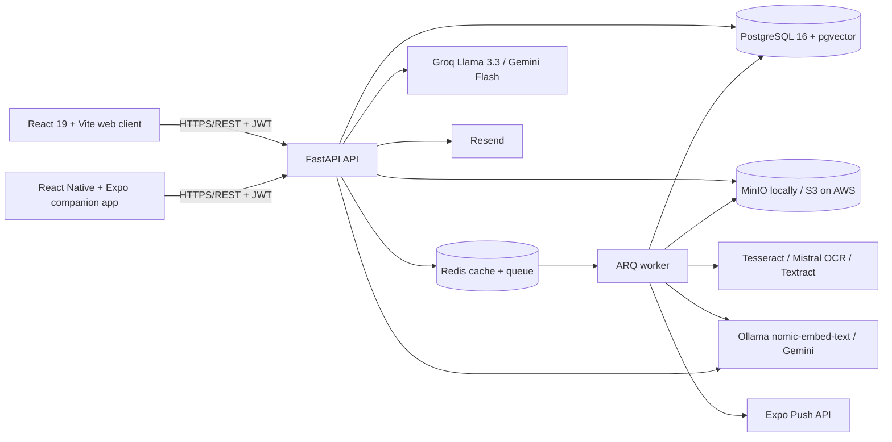

# As-built architecture

**Updated:** 2026-09-14

This document describes the current implementation. [DESIGN.md](DESIGN.md) is
the original design baseline and is retained to show why the architecture
changed during development.

## System view

## Runtime responsibilities

| Component | Responsibility |
|---|---|
| Web | Primary implemented client, including account management and rich document workflows |
| Mobile | Capture-focused companion client for documents, search and Q&A |
| API | Authentication, authorisation, CRUD, search, RAG orchestration and signed storage access |
| Worker | OCR, preprocessing, categorisation, chunking, embeddings and warranty notification jobs |
| PostgreSQL/pgvector | User metadata, extracted text, conversations, full-text indexes and embeddings |
| Redis | ARQ queue plus response/embedding cache with in-memory fallback |
| MinIO/S3 | Private original files and thumbnails under per-user prefixes |

## Upload and retrieval flow

1. An authenticated client submits a validated image or PDF.
2. The API stores the original under `users/{user_id}/`, creates a pending row
   and queues processing. If Redis is unavailable, it processes inline.
3. The worker preprocesses images, runs the configured OCR adapter, extracts
   metadata/warranty information, chunks the text and stores embeddings.
4. Keyword queries use PostgreSQL full-text search. Semantic queries use
   pgvector. RAG retrieval fuses both result sets and applies a relevance floor.
5. If Groq or Gemini is configured, the selected provider receives retrieved
   excerpts and conversation context. Otherwise, development mode returns the
   retrieved excerpts without claiming a generated answer.

## Security boundaries

- API endpoints derive the current user from a signed access token.
- User-owned database queries include the user identifier; cross-user document
  read, edit, share and delete attempts are integration-tested.
- Refresh tokens are rotated. Mobile tokens are stored with Expo SecureStore.
- Files are private and accessed through short-lived signed URLs.
- Account deletion removes database rows and all objects under the user prefix.
- File extensions, media types, file size and file signatures are validated.
- Rate limits cover authentication and password-reset endpoints.

These controls do not prove production security by themselves. Live TLS,
managed-secret, backup and infrastructure behaviour must be verified after AWS
deployment.

## Deployment view

Local development is a seven-service Docker Compose stack. The proposed AWS
environment uses CloudFront/S3 for the web client, an ECS API and worker, RDS
PostgreSQL, Redis, S3 and Secrets Manager. The infrastructure is defined but has
not been applied, so it must be described as cloud-ready rather than deployed.

## Provider reproducibility

Embedding vectors from different models must not be mixed. Pin
`EMBEDDING_PROVIDER` for each evaluation run and rebuild stored embeddings when
the provider/model changes. Record OCR backend, Q&A model, embedding provider,
prompt revision and commit SHA alongside every experiment.
